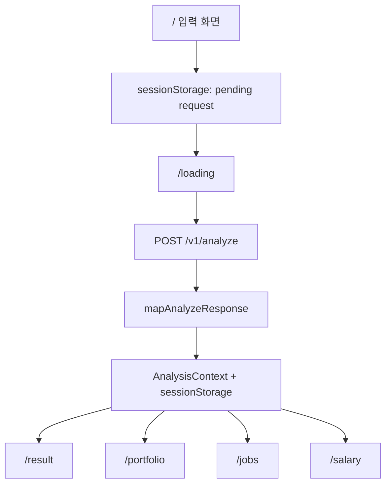

# Git2Value Frontend

Git2Value 프론트엔드는 GitHub 레포지토리를 기반으로 **포트폴리오 구조를 해석하고, 요약하고, 개선 방향을 제안하고, 채용공고와의 유사도 매칭을 보여주는** Next.js UI입니다.

이 프로젝트는 개발자 개인의 역량을 판정하지 않습니다. 점수와 등급은 사람에 대한 평가가 아니라, 공개 GitHub 포트폴리오에서 확인되는 구조적 신호와 보강 우선순위를 설명하는 참고 지표입니다.

## Tech Stack

| 영역 | 사용 기술 |
| --- | --- |
| Framework | Next.js 14 App Router |
| UI | React 18, Tailwind CSS |
| Language | TypeScript |
| Icons | lucide-react |
| State | React Context + `sessionStorage` |
| API | FastAPI `POST /v1/analyze` |

## Quick Start

```bash
npm install
copy .env.example .env.local
npm run dev
```

Open `http://localhost:3000`.

macOS/Linux에서는 아래처럼 복사할 수 있습니다.

```bash
cp .env.example .env.local
```

## Environment

| 환경 변수 | 필수 | 설명 |
| --- | --- | --- |
| `NEXT_PUBLIC_API_BASE_URL` | 예 | 백엔드 base URL. 예: `http://localhost:8080` |
| `NEXT_PUBLIC_USE_MOCK` | 아니오 | `true`이면 API 호출 없이 `src/data/mockReport.ts` 사용 |

`.env.example`

```env
NEXT_PUBLIC_API_BASE_URL=http://localhost:8080

# 개발용 mock 데이터 사용
# NEXT_PUBLIC_USE_MOCK=true
```

## Runtime Flow



## Backend Contract

프론트엔드는 백엔드의 최신 v7.2 응답 스키마를 기준으로 동작합니다. 이전 dual-schema fallback은 유지하지 않습니다.

### Request

```json
{
  "github_username": "user",
  "repos": ["user/repo", "user/repo2/tree/branch"],
  "applicant_years": 0
}
```

### Current Response Areas

| 응답 영역 | 프론트 사용 목적 |
| --- | --- |
| `github_score` | 전체 포트폴리오 분석 점수, 축별 상세 점수, 개선 여지 |
| `per_repo` | 레포별 유형, 기여 비율, 언어 구성, 진단 항목, 레포별 점수 상세 |
| `level` | 포트폴리오 구성 수준 설명 |
| `summary` | 요약 리포트, 구성 강점, quick wins |
| `job_matching` | 유사 공고 TOP 5, 도메인별 유사 공고, 도메인 경고 |
| `salary_band` | 매칭 직무 기준 시장 연봉 참고 범위 |
| `tech_analysis` | 공고 요구 기술과 겹치는 기술/보완 권장 기술 |
| `meta` | 버전, 분석 시간, 레포 수, LLM 사용 가능 여부 |

참조 샘플:

- `response_sample/analyze_tekyung_current_main_response.json`
- `response_sample/analyze_siheon012_current_main_response.json`

## Pages

| Route | 역할 |
| --- | --- |
| `/` | GitHub ID와 최대 3개 레포 입력, URL/`owner/repo` 형식 검증 |
| `/loading` | pending request를 읽어 `/v1/analyze` 호출, 진행 UI와 에러 처리 |
| `/result` | 포트폴리오 요약, 종합 점수, score detail, 분석 메타 표시 |
| `/portfolio` | 레포별 진단, 언어 구성, 협업 신호, 점수 상세 표시 |
| `/jobs` | FAISS 유사도 기반 매칭 공고 TOP 5와 도메인별 유사 공고 표시 |
| `/salary` | 매칭 직무 기준 시장 연봉 밴드와 참고 직무 비교 표시 |
| `/help` | 입력값/환경/분석 문제 해결 가이드 |

## Project Identity

Git2Value의 문구와 UI는 아래 원칙을 따릅니다.

| 사용 가능 | 피해야 할 표현 |
| --- | --- |
| 포트폴리오 분석 점수 | 개발 역량 점수 |
| 포트폴리오 구성 수준 | 개발자 수준 |
| 유사 공고, 매칭 공고 | 적합한 직무, 추천 직무 |
| 시장 연봉 참고 범위 | 예상 연봉 |
| 항목별 진단, 개선 제안 | 능력 평가 |

따라서 결과 화면의 주어는 지원자 개인이 아니라 **레포지토리/포트폴리오/프로젝트 구성**입니다.

## Repo Type Handling

레포 유형과 배점 기준은 분리해서 표시합니다.

| 케이스 | 표시 방식 |
| --- | --- |
| 개인 레포 | 개인 레포지토리 |
| 팀 레포 | 팀 레포지토리 |
| 팀 경험이 있으나 지배적 기여로 개인 기준 배점 | 개인 레포지토리 + 팀 레포에서 개인 기준으로 재판정 문구 |

`is_dominance_override`와 `has_team_experience`가 함께 true이면 `/portfolio`의 레포 유형 영역에 팀 레포 감지 후 개인 기준으로 재판정되었다는 설명을 표시합니다.

## Source Structure

```text
src/
  app/
    page.tsx
    loading/page.tsx
    result/page.tsx
    portfolio/page.tsx
    jobs/page.tsx
    salary/page.tsx
    help/page.tsx
  components/
    portfolio/
      RepoAnalysisTabs.tsx
      RepoAnalysisPanel.tsx
    jobs/
      DomainJobPicksPanel.tsx
    Common.tsx
    PageShell.tsx
    ScoreRing.tsx
    SalaryBand.tsx
  context/
    AnalysisContext.tsx
  data/
    mockReport.ts
    uiContent.ts
  lib/
    analysisResult.ts
    mapAnalyzeResponse.ts
    parseGithubRepo.ts
    pendingAnalysis.ts
    domainIcons.ts
    utils.ts
  types/
    api.ts
    analysis.ts
```

## Important Files

| 파일 | 설명 |
| --- | --- |
| `src/types/api.ts` | 백엔드 응답 타입. 최신 v7.2 스키마 기준 |
| `src/types/analysis.ts` | UI가 사용하는 정규화된 결과 모델 |
| `src/lib/mapAnalyzeResponse.ts` | 백엔드 JSON을 UI 모델로 변환하는 핵심 mapper |
| `src/context/AnalysisContext.tsx` | 분석 결과를 context와 sessionStorage에 보관 |
| `src/lib/pendingAnalysis.ts` | `/`에서 `/loading`으로 넘기는 요청 저장소 |
| `src/data/mockReport.ts` | mock 모드에서 사용하는 UI 모델 샘플 |
| `Project_Identity_Guide.md` | 문구/표현 기준 문서 |
| `handoff.md` | 다음 에이전트용 프로젝트 인수인계 |

## Development Scripts

| 명령 | 설명 |
| --- | --- |
| `npm run dev` | 개발 서버 실행 |
| `npm run typecheck` | TypeScript 검사 |
| `npm run build` | production build |
| `npm run start` | build 결과 실행 |

권장 검증:

```bash
npm run typecheck
npm run build
```

## Manual Smoke Test

1. `.env.local`에 `NEXT_PUBLIC_API_BASE_URL`을 설정합니다.
2. `npm run dev`로 프론트를 실행합니다.
3. GitHub ID와 레포를 입력해 `/loading`에서 API 호출이 완료되는지 확인합니다.
4. `/result`에서 종합 점수와 score detail이 함께 표시되는지 확인합니다.
5. `/portfolio`에서 레포별 점수 상세, 운영도 기준, 팀->개인 재판정 문구를 확인합니다.
6. `/jobs`에서 유사 공고 TOP 5, 다중 도메인 패널, 공고 본문을 확인합니다.
7. `/salary`에서 시장 연봉 밴드와 참고 직무 비교표를 확인합니다.

## CORS

백엔드 `CORS_ORIGINS`에 프론트 origin을 등록해야 합니다.

| 환경 | Origin |
| --- | --- |
| Local | `http://localhost:3000` |
| Production | Vercel 등 실제 프론트 URL |

## Assets

이미지 리소스는 `public/images/`에 있습니다. UI는 해당 경로의 정적 asset을 직접 참조합니다.
