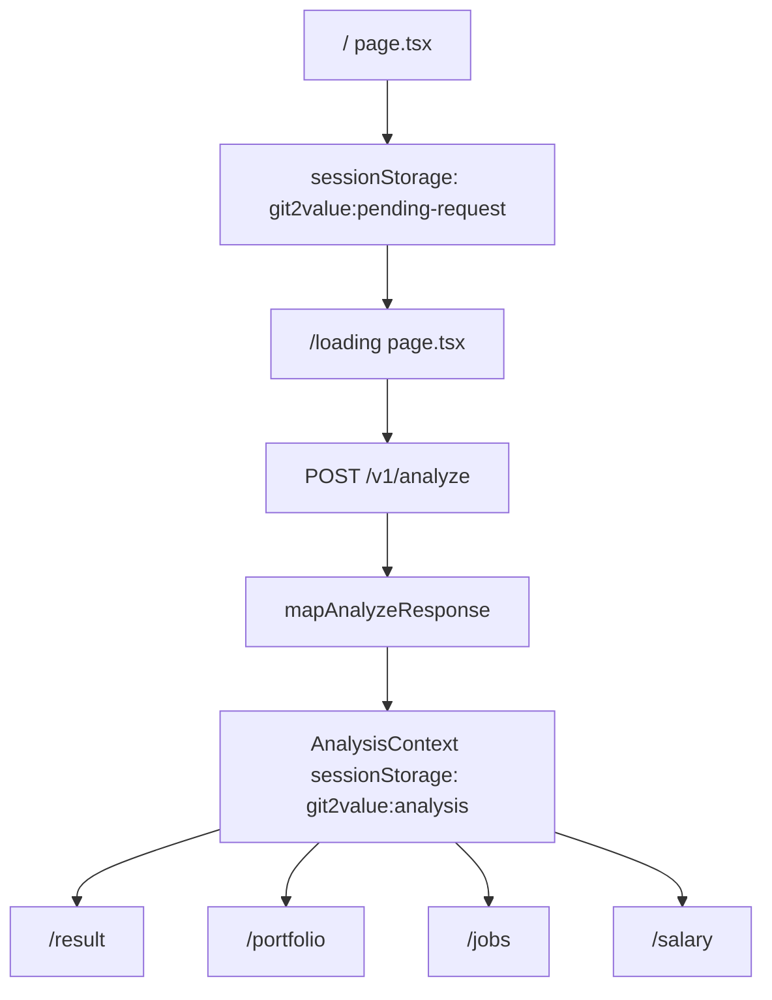

# Git2Value Frontend Handoff

Last updated: 2026-06-01

이 문서는 앞으로 새 에이전트 세션이 시작될 때 먼저 읽는 인수인계 문서다. 수정이 생기면 반드시 최신 상태로 갱신한다.

## Project Snapshot

- Project: Git2Value frontend
- Stack: Next.js 14 App Router, React 18, TypeScript, Tailwind CSS
- Workspace: `c:\Users\tekyung\.cursor\Capstone\2026_Capstone-frontend-v2`
- Original reference: `backup_origin/2026_Capstone-frontend-v2`
- Git status: 현재 workspace는 `.git`이 없는 상태다. `git status`는 사용할 수 없다.
- Generated / external folders: `.next/`, `node_modules/`는 handoff 기준에서 제외한다.

## Current Runtime Flow

Original project was mock/polling based. Current project calls the backend E2E API directly.



### API

- Endpoint: `POST {NEXT_PUBLIC_API_BASE_URL}/v1/analyze`
- Request shape:
  - `github_username: string`
  - `repos: string[]`
  - `applicant_years: number` (currently fixed to `0`)
- Env:
  - `NEXT_PUBLIC_API_BASE_URL` required unless mock is enabled
  - `NEXT_PUBLIC_USE_MOCK=true` returns `src/data/mockReport.ts` without API call
- Example `.env.local` used during testing:
  - `NEXT_PUBLIC_API_BASE_URL=https://desktop-75bjpd-lab4090.tail6dd0ea.ts.net/`

## Original vs Current: Major Changes

### Original (`backup_origin/`)

The original app had:

- Mock-only data flow in `src/lib/analysisResult.ts`
- Fake `startAnalysis`, `getAnalysisStatus`, `fetchAnalysisResult`
- Result pages mostly using static/mock report data
- No typed backend API response model
- No session-wide `AnalysisContext`
- No `pendingAnalysis` storage between `/` and `/loading`
- No `parseGithubRepo` helper
- No mapper from backend response to UI result model
- No `components/portfolio/RepoAnalysisPanel.tsx`
- No `components/portfolio/RepoAnalysisTabs.tsx`
- No `components/jobs/DomainJobPicksPanel.tsx`
- No `.env.example`

### Current

The current app:

- Validates GitHub username and up to 3 repo URLs/paths on `/`
- Stores pending request in sessionStorage, then navigates to `/loading`
- Calls FastAPI `/v1/analyze` from `analyzePortfolio()`
- Converts raw backend JSON into `AnalysisResult` via `mapAnalyzeResponse()`
- Stores final result in `AnalysisContext` and sessionStorage
- Redirects result pages to `/` if no result exists
- Uses latest v7.2 schema from `response_sample/analyze_tekyung_current_main_response.json` and `response_sample/analyze_siheon012_current_main_response.json`
- Supports single-domain and multi-domain job matching responses
- Keeps English backend feedback as-is intentionally

## Current Source Structure

Important app files:

```text
src/
  app/
    page.tsx                  # input page, validation, pending request save
    loading/page.tsx          # calls /v1/analyze, stores result, handles errors
    result/page.tsx           # summary, score metadata, summary text, analysis meta
    portfolio/page.tsx        # repo tabs and portfolio detail entry
    jobs/page.tsx             # TOP5 jobs, multi-domain sections, job text
    salary/page.tsx           # salary band, salary note/description
    help/page.tsx             # troubleshooting guide
    layout.tsx                # wraps Providers
  components/
    Providers.tsx             # AnalysisProvider wrapper
    portfolio/
      RepoAnalysisTabs.tsx
      RepoAnalysisPanel.tsx
    jobs/
      DomainJobPicksPanel.tsx
    Common.tsx
    Header.tsx
    PageShell.tsx
    ScoreRing.tsx
    SalaryBand.tsx
  context/
    AnalysisContext.tsx       # result session store
  data/
    mockReport.ts             # mock AnalysisResult
    uiContent.ts
  lib/
    analysisResult.ts         # backend API call + mock switch
    domainIcons.ts            # domain string -> lucide icon mapping
    mapAnalyzeResponse.ts     # backend JSON -> AnalysisResult
    parseGithubRepo.ts        # URL/path validation and normalization
    pendingAnalysis.ts        # pending request sessionStorage
    utils.ts
  types/
    api.ts                    # backend API response types
    analysis.ts               # frontend UI model
```

Root-level notable files:

- `README.md`: updated with backend API/env/CORS instructions
- `.env.example`: backend URL and mock flag sample
- `response_sample/analyze_tekyung_current_main_response.json`: current main sample (team quality mode, multi-domain)
- `response_sample/analyze_siheon012_current_main_response.json`: current main sample (personal quality mode, dominance override)
- `reaponse_data/response_team.json`: team repo sample, extra test/CI/CD/deploy `필수 미흡`
- `reaponse_data/response_team2.json`: team repo sample (low score), core readme `미흡` -> UI `개선 필요`
- `reaponse_data/response_1779089757441.json`: older sample response
- `backup_origin/`: original project snapshot

## Data Models

### Backend API types (`src/types/api.ts`)

The API model supports:

- `github_score`
  - `total`
  - `method`
  - `breakdown`
  - `breakdown_note`
  - `axes`
  - `score_detail`
- `per_repo[]`
  - repo type / authors / dominance / fork
  - team-experience split fields: `has_team_experience`, `is_dominance_override`, `target_commit_ratio_census`, `contribution_role`
  - score breakdown + `score_detail`
  - commit counts
  - `active_weeks`, `repo_active_weeks`
  - `detected_domains`
  - frameworks
  - `language_category.main/sub/trivial`
  - diagnosis core/extra items
- diagnosis items
  - `status`
  - `detail`
  - `action`
  - `llm_used`
  - `llm_scores`
  - `llm_suggestions`
- `job_matching`
  - `primary_domain`
  - `detected_domains`
  - rerank note
  - `is_multi_domain`
  - TOP5 eligible matches
  - domain check/mismatch (`domain_mismatch`)
  - `multi_domain_picks`
  - jumpit category
  - company types
- `salary_band`
  - `matched_category`
  - `salary_range`
  - realistic range (`median/p25/p75`)
  - `note`
  - reference categories (object[] or string[])
- `tech_analysis`
  - matched/missing techs (`matched_techs`/`missing_techs`)
  - learning suggestions
  - company types
- `meta`
  - version
  - llm availability
  - analysis time seconds
  - repos analyzed
  - applicant years

### Frontend result model (`src/types/analysis.ts`)

`AnalysisResult` is the UI-facing model. It includes:

- applicant info
- aggregate score and score meta
- repo analyses with language breakdown, detected domains, README details
- jobs with effective score, similarity, category, posting text
- job summary
- tech match notes and learning suggestions
- salary note/range description
- level/summary/summaryText
- detected domains, multi-domain metadata, company types, jumpit category
- analysis meta
- warnings and domain consistency

## Mapping Rules

Main mapper: `src/lib/mapAnalyzeResponse.ts`

Important mapping behavior:

- Score:
  - Backend `github_score.breakdown.contribution` -> UI `activity`
  - `quality` -> `management`
  - `consistency` -> `consistency`
  - `method` / `breakdown_note` -> `scoreMeta`
- Diagnosis:
  - `detail` -> `desc`
  - `action` -> action block
  - `llm_scores` -> README score bars
  - `llm_suggestions` -> README additional suggestions
  - `llm_used` -> LLM chip
  - status mapping (explicit, no unknown -> `필수 미흡` fallback):
    - `양호` / `규칙적` -> `양호`
    - `보통` -> `보통`
    - `개선 필요` / `미흡` -> `개선 필요`
    - `없음` -> `없음` (personal extra: test/CI/CD/deploy absent, non-penalty)
    - `필수 미흡` -> `필수 미흡` (team extra mandatory items)
  - `extra_items` -> `teamChecks`; `repoKind` from `repo_type` for portfolio UI section title
- Team experience:
  - `repo_type` is scoring context, not sole team-experience truth
  - `has_team_experience` is used for team-experience badge/context
  - display label priority:
    - `is_dominance_override && has_team_experience` -> 팀 레포 감지 + 개인 기준 재판정 라벨
    - `repo_type === team` -> team repo label with role/ratio
    - else -> personal repo label
  - contribution role fallback:
    - source ratio = `target_commit_ratio_census ?? target_commit_ratio`
    - `>= 0.5`: 주도 기여 / `>= 1/distinct_author_count`: 적극 기여 / else: 협업
- Languages:
  - `language_category.main/sub/trivial` -> `languageBreakdown`
  - tech stack uses frameworks plus all non-zero language names
- Active weeks:
  - `active_weeks` -> applicant active weeks
  - `repo_active_weeks` -> full repo active weeks
  - weekly commits parsed from `commit_pattern.detail` using `/약\s*([\d.]+)회/`
- Jobs:
  - `eligible_matches` -> TOP5 table
  - `similarity` and `effective_score` are both preserved
  - `domain_boosted` -> "가산" chip
  - `multi_domain_picks` is used for `postingText`/domain picks
- Job summary:
  - `totalPostings` is intentionally hard-coded to `3,400건`
- Salary:
  - `salary_range` platform medians are displayed directly
  - `realistic_range.median/p25/p75` are converted to won-based UI format
- Tech:
  - `matched_techs`/`missing_techs` are used for notes
- Summary:
  - `summary.text` -> `summaryText`
- Meta:
  - `meta.version`, `llm_available`, `analysis_time_seconds`, `repos_analyzed` are displayed on `/result`

## UI Behavior by Page

### `/`

File: `src/app/page.tsx`

- User inputs GitHub ID and up to 3 repo URLs/paths.
- Accepted repo formats:
  - `owner/repo`
  - `owner/repo/tree/branch`
  - GitHub URLs that normalize to those forms
- Saves request to `sessionStorage` key `git2value:pending-request`.
- `applicant_years` is fixed to `0`.

### `/loading`

File: `src/app/loading/page.tsx`

- Reads pending request.
- Calls `analyzePortfolio()`.
- Uses fake/progressive UI while the synchronous backend API runs.
- On success:
  - clears pending request
  - stores result in `AnalysisContext`
  - redirects to `/result`
- On failure:
  - displays Korean error
  - allows retry/back/help

### `/result`

File: `src/app/result/page.tsx`

- Shows aggregate score and score meta tooltip.
- Shows positioning and level description if different.
- Shows detected domains as chips when multiple domains exist.
- Shows `summaryText` in a "상세 분석 리포트" details block.
- Shows analysis meta at bottom:
  - version
  - analysis time
  - repos analyzed
  - LLM availability

### `/portfolio`

Files:

- `src/app/portfolio/page.tsx`
- `src/components/portfolio/RepoAnalysisTabs.tsx`
- `src/components/portfolio/RepoAnalysisPanel.tsx`

Behavior:

- Shows up to 3 repo tabs.
- Per repo:
  - score ring
  - repo type, author count, fork status
  - tech stack
  - detected domain chips
  - core diagnosis and extra checks
  - extra checks section title by `qualityMode`:
    - personal mode: "추가 점검 항목" (없어도 불이익 없이, 있으면 가산)
    - team mode: "팀 기준 필수 점검 항목" (`필수 미흡` 가능)
  - score detail axes/items per repo
  - dominance override case shows team->personal re-judged label in repo type area
  - README LLM chip, scores, action, suggestions
  - total/applicant commits
  - applicant active weeks and full repo active weeks
  - weekly commits when parsed
  - language breakdown table
  - collaboration signals
- Card height limits were removed so README/detail content can expand.

### `/jobs`

Files:

- `src/app/jobs/page.tsx`
- `src/components/jobs/DomainJobPicksPanel.tsx`

Behavior:

- Quick stats show:
  - 분석 공고: `3,400건`
  - 매칭 후보: TOP matches count
  - 평균 점수
  - 도메인 일치
- Shows warning/rerank banners.
- Shows mixed-domain chip and detected domain chips.
- TOP5 table includes:
  - company/title
  - effective score
  - raw similarity
  - category
  - experience
  - similarity label
  - domain boost chip
  - posting body details if available
- For multi-domain responses, shows `DomainJobPicksPanel`:
  - domain tabs
  - picks per domain
  - company/position/category/similarity/experience
  - posting text open by default
- Shows company type list, jumpit category, and learning suggestions when present.

### `/salary`

File: `src/app/salary/page.tsx`

- Shows selected role, career range, data source.
- Domain chip:
  - true -> `도메인 일치`
  - false -> `도메인 검토 필요`
  - undefined -> hidden
- Shows `salary.note`.
- Shows salary band and `rangeDescription`.
- Shows platform medians and reference categories.

## Important Sample Responses

### `response_sample/analyze_tekyung_current_main_response.json` (current)

- 1 repo, `repo_type: team`
- `quality_mode: team`, quality axis mode = `team`
- `multi_domain_picks` populated
- domain mismatch warning exists

Expected UI:

- `/portfolio`: 팀 기준 필수 점검 안내 + score detail 표시
- `/jobs`: 도메인 경고/다중 도메인 패널 표시
- `/salary`: `salary_range` + `realistic_range` 기반 카드 표시

### `response_sample/analyze_siheon012_current_main_response.json` (current)

- 3 repos (Deepsentinel/langgraph-api/korean_finetuning)
- Deepsentinel: `repo_type: personal`, `has_team_experience: true`, `is_dominance_override: true`
- global score `80.4`, representative score detail `88.0` (breakdown_note: 최고 레포 기준)
- `quality_mode: personal` with personal quality items

Expected UI:

- `/portfolio`: 팀 레포 감지 -> 개인 기준 재판정 문구 노출
- `/result`: total score와 score detail total의 의미를 분리해서 표시
- `/jobs`: 유사 공고 중심 문구와 다중 도메인 패널 표시
- `/salary`: reference category 비교표 정상 표시

### Copy Guideline Update (2026-06-01)

- Result/Portfolio/Jobs/Salary/Help 문구를 `Project_Identity_Guide.md` 기준으로 정리:
  - 사람 역량 평가 표현 제거
  - 유사도 기반 매칭/시장 참고 정보 표현 사용
  - "추천 직무" 중심 문구를 "매칭 공고/유사 공고"로 조정

## Verification Status

Known successful checks:

- `npm run typecheck` passed after latest implementation
- `npm run build` passed after latest implementation

Known caveat:

- A one-off `npx tsx -e ...` script intended to map both sample JSON files hung/was aborted. Do not treat that script as a failed app check. TypeScript and production build passed.

Recommended verification after future changes:

```bash
npm run typecheck
npm run build
```

Manual smoke test:

1. Set `.env.local` with `NEXT_PUBLIC_API_BASE_URL`.
2. Run `npm run dev` or `npm run build && npm start`.
3. Analyze `response_sample/analyze_tekyung_current_main_response.json`-like repo and confirm:
   - `3,400건` analysis count
   - team quality-mode 안내와 score detail 섹션 노출
   - domain warning + multi-domain picks panel
4. Analyze `response_sample/analyze_siheon012_current_main_response.json` and confirm:
   - global total score와 representative score detail 값이 분리 노출
   - jobs/salary/portfolio sections render without mapper crash
   - `matched_techs`/`missing_techs` 기반 매칭 근거 노출
5. Analyze dominance override case and confirm:
   - portfolio card shows `팀 경험 있음` + `지배적 기여` badges
   - repo type field includes team->personal re-judged label
   - contribution ratio/role fallback is rendered without null crash

## Known Constraints / Decisions

- Backend output is trusted. Do not override `repo_type` in frontend.
- `repo_type` (scoring context) and `has_team_experience` (team experience context) are intentionally separate and both should be shown where useful.
- English README/LLM output is intentional for token-saving and should not be translated unless explicitly requested.
- `applicant_years` is fixed to `0` for now.
- `totalPostings` is intentionally hard-coded to `3,400건`.
- API is synchronous; loading page uses fake/progressive client-side progress while waiting.
- No original raw JSON is stored in `AnalysisContext`; only mapped `AnalysisResult` is stored.
- `AnalysisContext` uses sessionStorage, so refresh within the same tab keeps the result but new tabs may not.
- `NEXT_PUBLIC_USE_MOCK=true` bypasses backend and uses `mockReport`.
- Do not edit `backup_origin/`; it is the original reference.
- Avoid committing generated folders (`.next`, `node_modules`) or local secrets (`.env.local`).

## Files Added Since Original

- `handoff.md`
- `.env.example`
- `src/types/api.ts`
- `src/lib/parseGithubRepo.ts`
- `src/lib/mapAnalyzeResponse.ts`
- `src/lib/pendingAnalysis.ts`
- `src/lib/domainIcons.ts`
- `src/context/AnalysisContext.tsx`
- `src/components/Providers.tsx`
- `src/components/portfolio/RepoAnalysisTabs.tsx`
- `src/components/portfolio/RepoAnalysisPanel.tsx`
- `src/components/jobs/DomainJobPicksPanel.tsx`
- `response.json`
- `response_ver2.json`
- `response_1779089757441.json`

## Files Heavily Modified Since Original

- `src/lib/analysisResult.ts`
  - mock polling functions replaced with API call and mapper
- `src/types/analysis.ts`
  - expanded UI-facing model for API-backed result data
- `src/app/page.tsx`
  - input validation and pending request flow
- `src/app/loading/page.tsx`
  - synchronous API call, error handling, session storage
- `src/app/result/page.tsx`
  - API-backed summary, score metadata, detailed report/meta
- `src/app/portfolio/page.tsx`
  - uses `useAnalysis()` and repo tabs
- `src/app/jobs/page.tsx`
  - API-backed TOP5, multi-domain picks, posting body display
- `src/app/salary/page.tsx`
  - API-backed salary band, domain chip, note/range description
- `src/data/mockReport.ts`
  - updated to match expanded `AnalysisResult`
- `src/app/layout.tsx`
  - wraps the app with `Providers`
- `README.md`
  - backend API and env docs

## Next-Agent Checklist

When starting a new session:

1. Read this file first.
2. If behavior seems odd, compare current files against `backup_origin/2026_Capstone-frontend-v2`.
3. Do not revert user/agent changes unless explicitly requested.
4. Run `npm run typecheck` after type/model changes.
5. Run `npm run build` after UI/data-flow changes.
6. Update this `handoff.md` whenever architecture, API shape, page behavior, env, or known caveats change.
